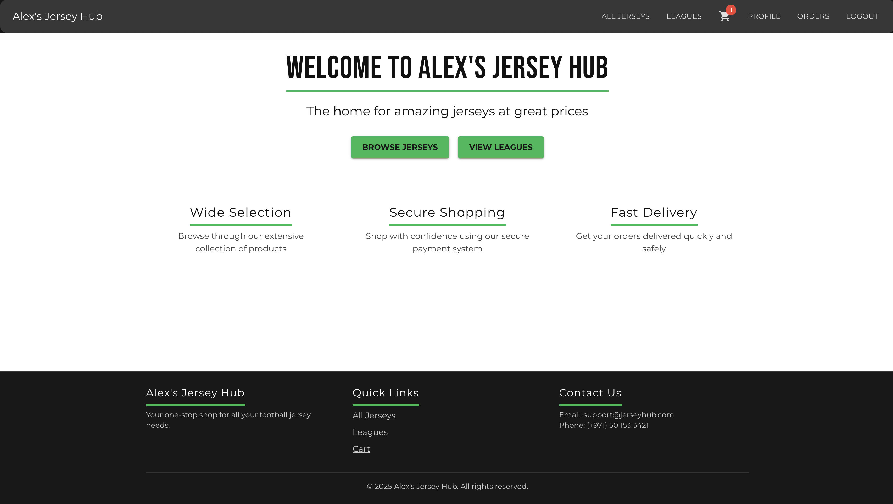
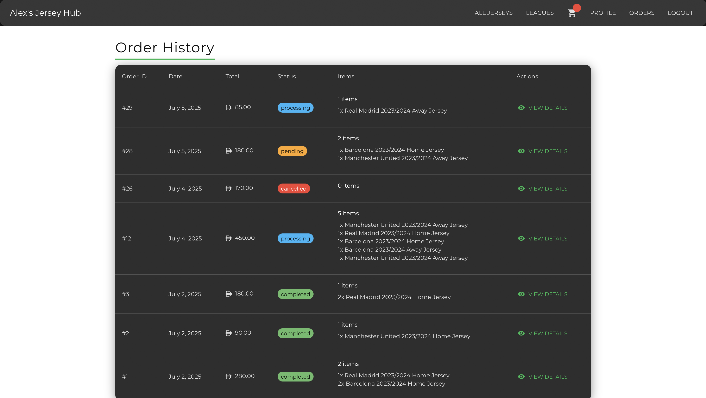
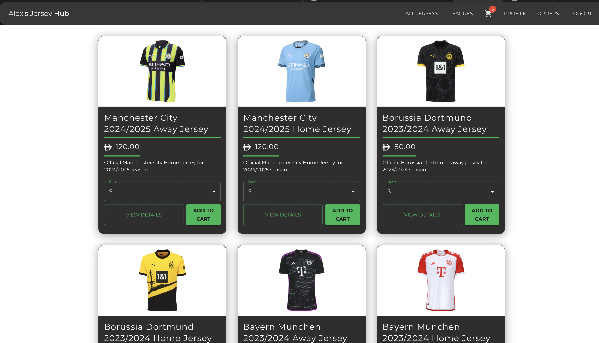
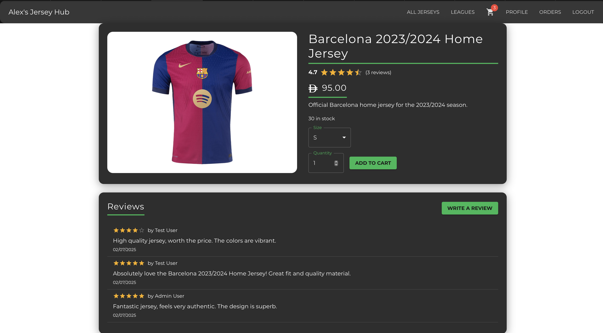
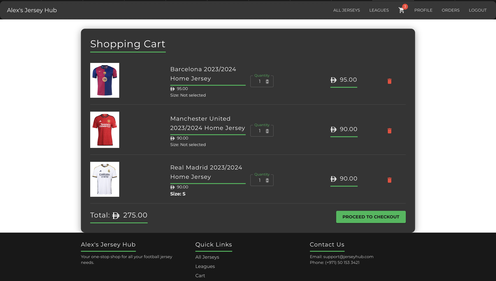
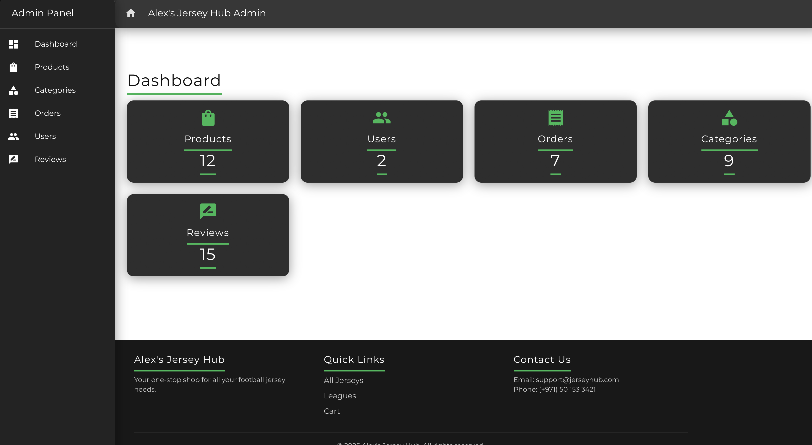

# Alex's Jersey Hub Platform

A specialized football/soccer jersey e-commerce platform built with Laravel and React.

### Live Demo URLs
- **Backend (API) on Render:** https://alexjerseyhubbackend.onrender.com
- **Frontend (App) on Render:** https://alexjerseyhubfrontend.onrender.com/

> **Note:** Once the backend is loaded and shows a success message, you can open the frontend URL to use the platform.

### Demo Login Credentials

#### Regular User Account
- **Email:** user@example.com
- **Password:** password

#### Admin Account
- **Email:** admin@example.com
- **Password:** admin123

## Screenshots

  
  
  
  
  
  


## Features

### Jersey Management
- Browse by clubs (categories with a parent league)
- Browse by leagues (top-level categories)
- Filter by season and kit type (home/away/third)
- Size variations (S, M, L, XL, XXL)
- High-quality jersey images
- Detailed product descriptions

### Shopping Experience
- Club-based and league-based navigation
- Size guide
- Season filtering
- Kit type selection
- Stock management by size

### Admin Management
- Manage leagues (top-level categories)
- Manage clubs (categories with a parent league)
- Assign products to clubs (with league context shown in UI)
- Product Management table shows both club and league for each product
- Category Management allows setting a parent (league) for each club and displays league names

## Technical Stack

### Frontend
- React 18
- Material-UI (MUI)
- React Router
- Axios

### Backend
- Laravel 10
- PostgreSQL database
- JWT authentication
- RESTful API

## Project Structure

```
├── backend/                 # Laravel API backend
└── frontend/               # React frontend
```

See individual README files in each directory for detailed documentation on setup, API endpoints, and project structure.

## Getting Started

### Prerequisites
- PHP 8.1 or higher
- Node.js 16 or higher
- PostgreSQL
- Composer
- npm

### Backend Setup
1. Navigate to the backend directory:
```bash
cd backend
```
2. Install PHP dependencies:
```bash
composer install
```
3. Configure environment:
```bash
cp .env.example .env
php artisan key:generate
```
4. Run migrations and seeders:
```bash
php artisan migrate:fresh --seed
```
5. Start the Laravel server:
```bash
php artisan serve
```

For detailed instructions on backend setup, including database configuration and image handling, refer to the `backend/README.md` file.

### Frontend Setup
1. Navigate to the frontend directory:
```bash
cd frontend
```
2. Install Node dependencies:
```bash
npm install
```
3. Start the development server:
```bash
npm run dev
```

For detailed instructions on frontend setup, including environment variable configuration for API and image fetching, refer to the `frontend/README.md` file.

## API Endpoints

### Authentication
- POST `/api/register` - User registration
- POST `/api/login` - User login
- POST `/api/logout` - User logout
- GET `/api/user` - Get authenticated user

### Products
- GET `/api/products` - List all products
- GET `/api/products/{id}` - Get product details
- GET `/api/products/search` - Search products

### Categories (Leagues & Clubs)
- GET `/api/categories` - List all categories (leagues and clubs)
- GET `/api/categories/{id}` - Get category details
- POST `/api/categories` - Create category (admin)
- PUT `/api/categories/{id}` - Update category (admin)
- DELETE `/api/categories/{id}` - Delete category (admin)

### Cart
- GET `/api/cart` - Get user's cart
- POST `/api/cart/items` - Add item to cart
- PUT `/api/cart/items/{id}` - Update cart item quantity
- DELETE `/api/cart/items/{id}` - Remove item from cart

## Testing

### Backend Tests
```bash
cd backend
php artisan test
```

Available test suites:
- Feature Tests: API endpoints and integration tests
- Unit Tests: Business logic and model tests

